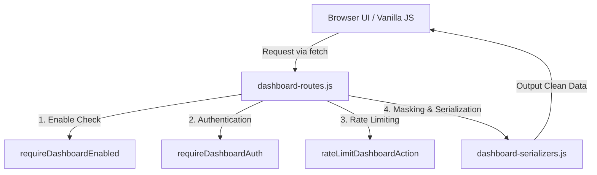

# Web Dashboard UI & Admin Control Panel (Phase 11)

Dashboard Web Administrasi adalah antarmuka kontrol visual yang tangguh dan aman bagi administrator Telegram AI OS. Berbasis static files Express vanilla (tanpa dynamic templating engines atau framework eksternal), dashboard ini menyajikan pemantauan real-time, kognisi memori user, audit kehandalan sistem, dan panel pemulihan aman.

## Arsitektur Sistem

### File Struktur
1. **Backend Layer (`src/dashboard/`)**
   - `dashboard-routes.js`: Hub integrasi routing API, static files middleware, dan error handling.
   - `dashboard-guards.js`: Proteksi otorisasi, penanganan rate limit action, sanitasi input, dan pencegahan kebocoran kunci rahasia.
   - `dashboard-serializers.js`: Menghapus data sensitif dan memotong konten panjang sebelum disajikan ke luar.
   - `dashboard-auth.js`: Pengecekan token bearer admin dan validasi konfigurasi env.
   - `dashboard-actions.js`: Eksekutor aksi aman seperti pembersihan telemetry, benchmark in-memory, dan diagnosa.
   
2. **Frontend Static Assets (`public/dashboard/`)**
   - `index.html`: Layout utama (modern dark mode, mobile-responsive sidebar).
   - `styles.css`: HSL variable styling, micro-animations, layout grid/flex, dan visualisasi skeleton loading.
   - `app.js`: Pengendali hash-routing router klien dan pooling health indicator.
   - `auth.js`: Penyimpan token di localStorage dan penanganan respon `401 Unauthorized`.
   - `api.js`: Wrapper fetch untuk interaksi API.
   - `ui.js`: Generator template rendering dinamis berbasis vanilla DOM.
   - `charts.js`: Grafik sparkline, lingkaran progress (SVG), dan horizontal progress bars (pure CSS).
   - `utils.js`: Toast notifications, modal konfirmasi tindakan, dan utility formatting.

## Konfigurasi Keamanan (Safe Controls)

Dashboard ini dirancang aman secara default untuk mencegah kebocoran kredensial atau eksploitasi remote:

1. **DASHBOARD_ENABLED**: Harus diset ke `'true'` di `.env` atau environment server untuk mengaktifkan antarmuka. Jika `false` (default), seluruh halaman /dashboard akan menampilkan status dinonaktifkan dan protected API mengembalikan status `401 Unauthorized`.
2. **DASHBOARD_ADMIN_TOKEN**: Kunci token administrator. Jika bernilai kosong saat dashboard diaktifkan, halaman login akan mendeteksi ketidaksesuaian ini dan menghentikan pengisian form masuk dengan memicu warning di UI.
3. **Regex Masking & Serialization**:
   - Seluruh data yang mengalir keluar melalui `/api/dashboard/*` dijalankan melalui fungsi `preventSecretLeak` yang menyensor string/key yang berbau token (Groq, Mistral, Postgres, Redis, Telegram, dll).
   - Nilai string mentah disensor menjadi `[redacted]` jika mencocokkan pola kunci rahasia, atau `set` / `missing` jika berupa properti konfigurasi.
4. **Action Rate Limiting**: Endpoint pengeksekusi tindakan administratif dibatasi maksimal 10 request per menit per identitas (IP / Token) untuk menghindari overload sistem.

## Fitur Tab Dashboard

Dashboard menyajikan 12 area fungsional:

1. **📊 Overview**: Panel ringkasan publik (status bot, uptime, storage driver) dan data admin terproteksi (reliability score, user data counts, quick actions).
2. **⚙️ Ops Viewer**: Visualisasi performa runtime Node, latensi response P50/P90/Max, konsumsi token LLM, dan status issues.
3. **🧠 Memory**: Eksplorasi catatan episodic, semantic, dan procedural user berdasarkan Telegram User ID dengan filter kata kunci.
4. **🎯 Goals**: Pelacakan kemajuan target/sasaran AI OS yang terencana per user.
5. **🔄 Workflows**: Visualisasi alur rencana multi-step dan hasil evaluasi per sub-langkah.
6. **💡 Insights**: Refleksi pelajaran kognitif, konsep relasi, dan skor tingkat kepentingannya.
7. **🕸️ Knowledge Graph**: Representasi visual keterhubungan konsep ingatan user menggunakan visualisasi SVG dinamis dan tautan relasi.
8. **⚡ Benchmarks**: Riwayat run pengujian performa AI OS, average score, status pas, dan deteksi regresi dari baseline.
9. **⚠️ Incidents**: Laporan incident produksi, dugaan penyebab, dan rekomendasi perbaikan real-time.
10. **📜 Commands**: Katalog command bot Telegram yang terdaftar beserta kategori fungsinya.
11. **🔒 Env Check**: Audit status ketersediaan environment variables tanpa membocorkan isi data rahasia.
12. **🔧 Settings**: Panel konfigurasi client token, status integrasi, dan checklist launch production aman.
